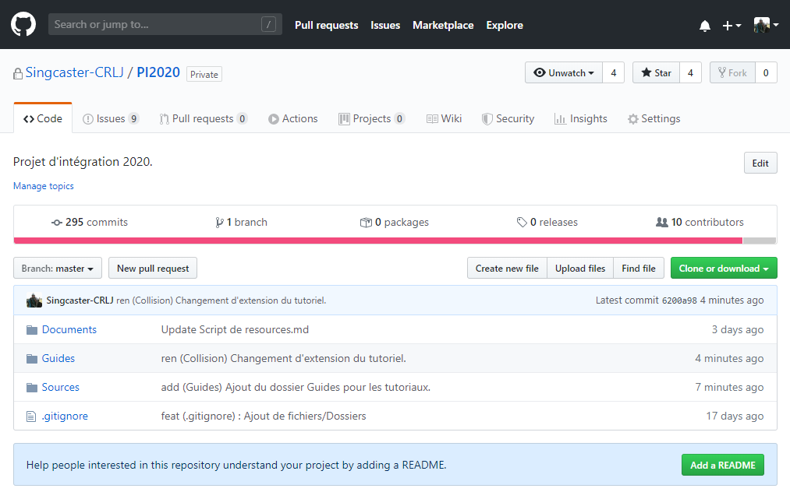
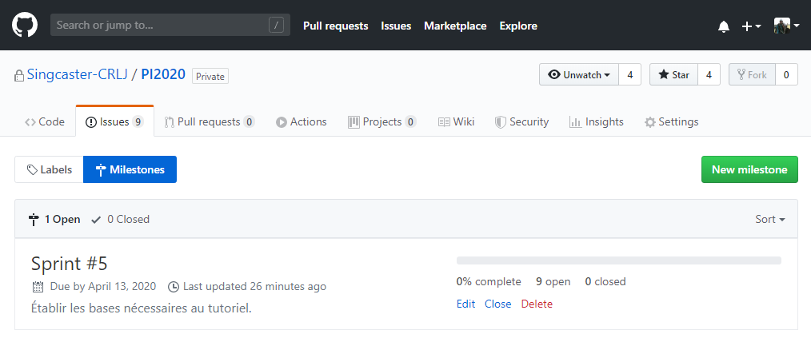
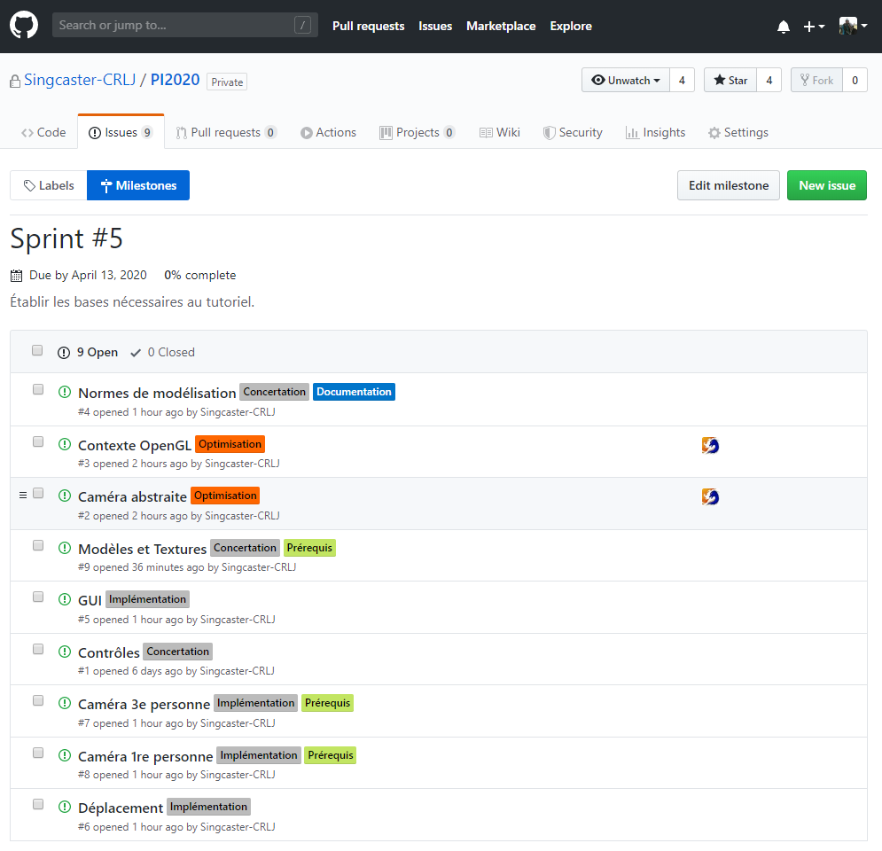
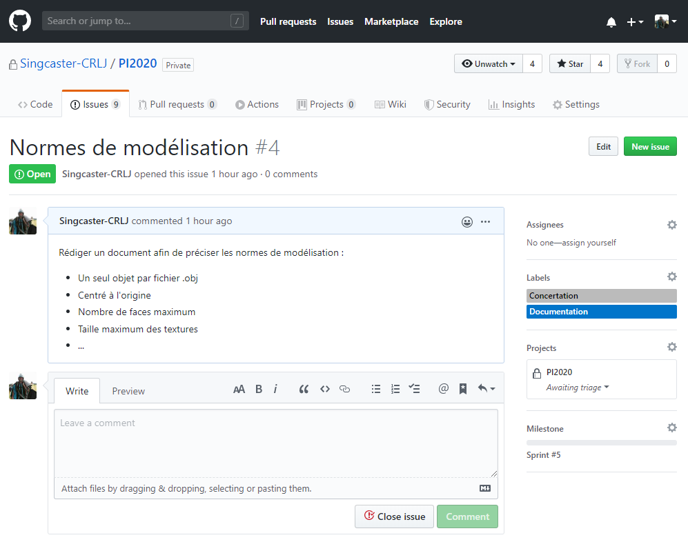

# GitHub

La page d'accueil permet de consulter toutes les modifications apportées à chacun des éléments du projet :

## Milestones

La section « Milestones » de l'onglet « Issues » permet d'afficher le « Sprint » en cours. On peut y consulter le titre (Sprint #5), l'objectif (Établir les bases nécessaires au tutoriel), l'échéance (13 avril 2020), le nombre de « Stories » (9) et le taux de complétion du « Sprint » :

### Issues

Le contenu du « Sprint » permet d'afficher les « Stories » en cours. On peut y consulter leur titre, leurs étiquettes et les personnes assignées à cette « Story » :

#### Étiquettes

Les étiquettes permettent de mieux cerner les « Stories ». Il est à noter que l'étiquette « Prérequis » indique que la description détaillée contient un lien vers les « Stories » prérequises à cette « Story ».

#### Issue

Le contenu d'une « Story » permet d'afficher les tâches en cours. On peut y consulter une description détaillée, assigner des personnes, attribuer des étiquettes, écrire des commentaires et clore la « Story » :

Il est de la responsabilité du « Product owner » de gérer les « Milestones » et les « Issues ». Les « Developers » peuvent ajouter des étiquettes, s'assigner comme contributeur, écrire des commentaires et clore la « Story ».
